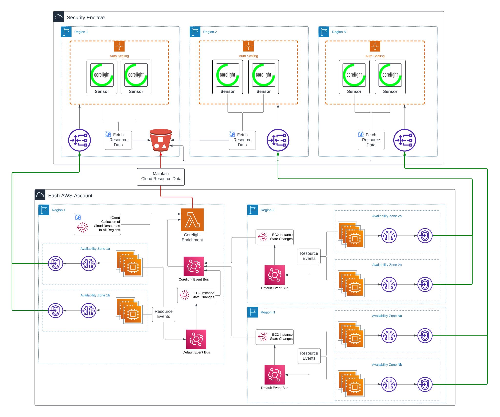

# terraform-aws-enrichment


## Getting Started
Corelight's AWS Cloud Enrichment requires the deployment of a lambda and its
supporting infrastructure to ensure the data in your Corelight cloud sensors are
always up-to-date with the latest state of your cloud resources.

### Preparation
Image based Lambdas must be deployed from a private Elastic Container Registry (ECR) 
repository and therefore the data collection serverless container image provided by 
Corelight must be copied from Dockerhub and pushed to your own ECR repository.

#### Copying the Corelight image
Corelight recommends install [skopeo](https://github.com/containers/skopeo/blob/main/install.md) to assist with copying this image.
```bash
AWS_ACCOUNT=<enter aws account id>
AWS_REGION=<enter ecr repository region>
ECR_REGISTRY="${AWS_ACCOUNT}.dkr.ecr.${AWS_REGION}.amazonaws.com"

# Pull from Dockerhub
CORELIGHT_REPO=corelight
CORELIGHT_IMAGE_NAME=sensor-enrichment-aws
CORELIGHT_IMAGE_TAG=1.0.0

SRC_IMAGE="$CORELIGHT_REPO/$CORELIGHT_IMAGE_NAME:$CORELIGHT_IMAGE_TAG"
DST_IMAGE="$ECR_REGISTRY/$CORELIGHT_IMAGE_NAME:$CORELIGHT_IMAGE_TAG"

# Pull Corelight Image
docker pull $SRC_IMAGE

# Login to ECR
aws ecr get-login-password --region $AWS_REGION | docker login \
    --username AWS \
    --password-stdin $ECR_REGISTRY

# Copy Image to ECR
skopeo copy docker://$SRC_IMAGE docker://$DST_IMAGE --dest-tls-verify
```

### Deployment
The variables for this module all have default values that can be overwritten
to meet your naming and compliance standards. The only variables without defaults are
the Lambda's ECR image name and tag which you will set during preparation.

Deployment examples can be found [here](examples)

## License

The project is licensed under the [MIT][] license.

[MIT]: LICENSE